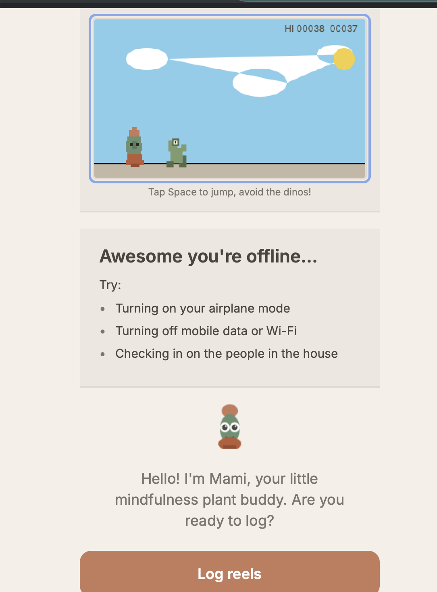
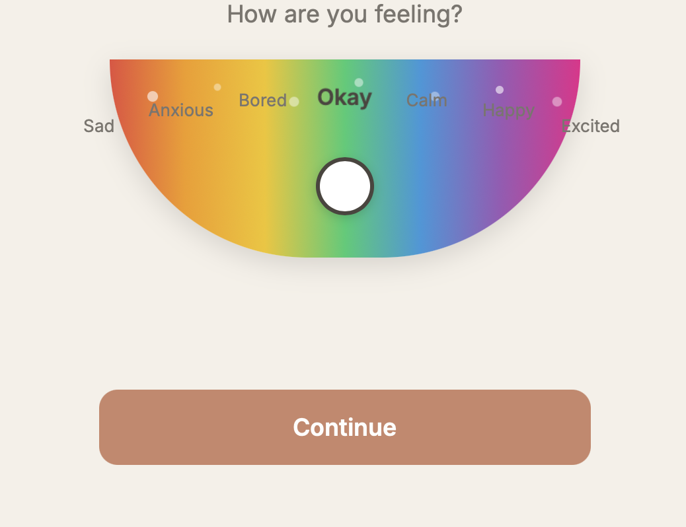
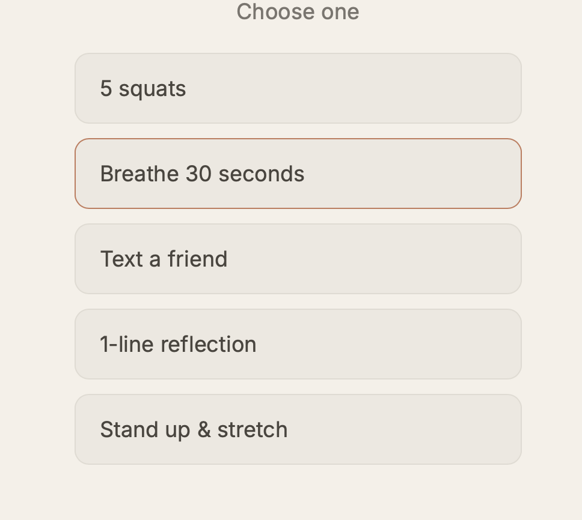
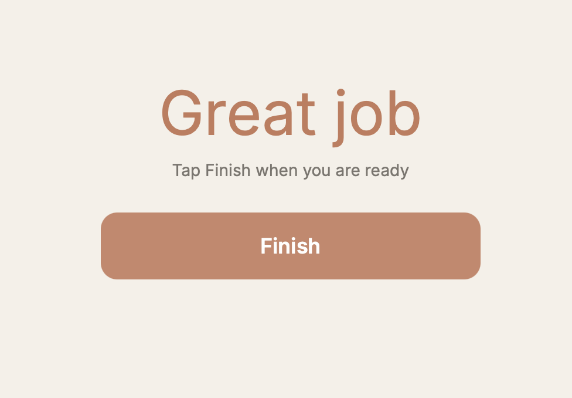

# ReelBreak

> A real-time mindfulness intervention app for compulsive social media use, built with Expo + React Native.

**Core idea: counting reels is not passive logging. It is a micro-intervention.**

By introducing intentional friction at the moment of automatic scrolling, ReelBreak converts subconscious behavior into a conscious decision point.
<p align="center">
  
  
  
  
</p>

---

## Table of Contents

- [Getting Started](#getting-started)
- [Tech Stack](#tech-stack)
- [Architecture](#architecture)
- [App Flow](#app-flow)
- [Scoring Model](#scoring-model)
- [Research Background](#research-background)
- [Roadmap](#roadmap)
- [References](#references)

---

## Getting Started

```bash
git clone https://github.com/sriramyapanja/ReelBreak.git
cd ReelBreak
npm install
npx expo start
```

| Key | Action |
|-----|--------|
| `i` | Open iOS Simulator |
| `a` | Open Android emulator |
| `w` | Open in browser (`npx expo start --web`) |

**Requirements:** Node.js ≥ 18, Expo CLI, iOS Simulator or Android emulator (or Expo Go on device).

---

## Tech Stack

| Layer | Library / Tool |
|-------|---------------|
| Framework | Expo SDK 52 + React Native 0.76 |
| Navigation | Expo Router 4 (file-based) |
| State | React Context + `useState` |
| Persistence | `@react-native-async-storage/async-storage` |
| UI | React Native core + `expo-linear-gradient` |
| Typography | Inter (`@expo-google-fonts/inter`, `expo-font`) |
| Game layer | `react-native-webview` with custom `<canvas>` logic |
| Language | TypeScript (strict mode) |

### Project Structure

```
ReelBreak/
├── app/                        # Expo Router screens (file = route)
│   ├── index.tsx               # Home — Mami + game + log entry
│   └── session/
│       ├── reel.tsx            # Reel count input
│       ├── mood.tsx            # Rainbow arc mood selector
│       ├── intervention.tsx    # Pause decision
│       ├── challenges.tsx      # Coping menu
│       ├── countdown.tsx       # Breathing protocol (3 rounds)
│       ├── squats.tsx          # Movement challenge
│       ├── finish.tsx          # Completion gate
│       ├── celebration.tsx     # Yay screen
│       └── reward.tsx          # Mami + affirmation
├── src/
│   ├── components/
│   │   ├── Cactus.tsx          # Animated mascot (Mami)
│   │   └── CactusRunnerGame.tsx # Dino-style runner game (WebView)
│   ├── context/
│   │   └── SessionContext.tsx  # Global session state + AsyncStorage sync
│   ├── lib/
│   │   ├── scoring.ts          # Points model (awareness-first)
│   │   └── cactusRunnerHTML.ts # Self-contained game HTML string
│   └── theme/
│       ├── colors.ts           # Warm sand palette
│       └── fonts.ts            # Inter weight tokens
└── preview/
    └── index.html              # Standalone browser preview (no build needed)
```

---

## Architecture

### Session State Machine

Each user interaction advances a typed state machine managed by `SessionContext`:

```
reel → mood → intervention → challenges → [countdown | squats | finish] → celebration
                           ↘ reward (skipped intervention)
```

State is held in React Context and written through to `AsyncStorage` on every reel count change, giving the app persistent memory across sessions without a backend.

### Intervention Layers

ReelBreak applies behavioral change in four stacked layers:

| Layer | Mechanism | Implementation |
|-------|-----------|----------------|
| 1 — Self-monitoring | Reel counting creates attention redirection | `session/reel.tsx` with hold-to-increment |
| 2 — Awareness prompt | Mood arc forces users to name emotional state | `session/mood.tsx` with `PanResponder` arc |
| 3 — Intentional pause | User chooses a coping action | `session/challenges.tsx` |
| 4 — Positive reinforcement | Mami celebrates completion, no shame language | `session/celebration.tsx`, `session/reward.tsx` |

### Scoring (`src/lib/scoring.ts`)

Points reward awareness and action, **not** abstinence:

```typescript
export const POINTS = {
  LOG_REEL_SESSION:       2,
  SELECT_MOOD:            2,
  CHOOSE_INTERVENTION:    3,
  COMPLETE_INTERVENTION:  5,
  EARLY_INTERRUPTION_BONUS: 2,
} as const;
```

---

## App Flow

```
Home
 └─ Log Reels         (hold +/- to count, persistent across sessions)
     └─ Mood Selector  (7-point rainbow arc: Sad → Excited)
         └─ Pause?
             ├─ Yes → Challenge Menu
             │         ├─ 5 Squats     → Finish → Celebration 🎉
             │         ├─ Breathe 30s  → 3-round 8-4-8 protocol → Finish → Celebration 🎉
             │         ├─ Text a Friend → Finish → Celebration 🎉
             │         ├─ 1-line Reflection → Finish → Celebration 🎉
             │         └─ Stand & Stretch → Finish → Celebration 🎉
             └─ No  → Reward (Mami + affirmation)
```

**Notable UX decisions:**
- Hold-to-increment on reel counter prevents accidental taps from being tedious
- Breathing uses a real timer (not animation-only) with round tracking
   

---

## Research Background

ReelBreak is grounded in a PICO-framed research gap in social media addiction literature.

### The Problem

Despite extensive empirical work, there is no sufficiently holistic, **process-level** model explaining how compulsive social media use unfolds moment to moment. Most studies explain *who* is at risk, not *how* behavior progresses in daily life.

### Four Gaps This Addresses

| Gap | Description | ReelBreak's Approach |
|-----|-------------|----------------------|
| **Process gap** | Studies explain vulnerability, not behavioral sequence | Captures trigger → state → action → outcome per session |
| **Measurement gap** | Retrospective surveys miss automatic behavior | In-moment logging at point of use |
| **Context gap** | Emotional state, time, prior activity under-modeled | Mood arc + session metadata per log |
| **Intervention translation gap** | Protective factors identified but not operationalized | Real-time coping menu tied to awareness layer |

### Intervention Model (PICO)

**Population:** Adults with compulsive short-form video use patterns  
**Intervention:** Real-time, context-aware app combining self-monitoring, mood logging, mindfulness prompts, and brief coping alternatives  
**Comparison:** Traditional cross-sectional self-report approaches and non-interactive tracking  
**Outcomes:** Improved self-awareness of triggers · more frequent interruption of automatic scrolling · increased healthy coping · reduced compulsive use · improved emotional self-regulation

### Evidence-Informed Coping Categories

Challenges in the app map to addiction recovery coping synthesis (Setiawan et al., 2024):

- **Social support** → Text a Friend
- **Mindfulness / awareness** → Breathe 30s
- **Behavioral substitution** → 5 Squats, Stand & Stretch
- **Cognitive / reflection** → 1-line Reflection

### Research Positioning

This project operates as both:
1. **Theory-building** - capturing process-level behavioral traces longitudinally
2. **Intervention-enabling** — real-time micro-actions that support self-regulation in the moment

It is not only a tracker. It is a **behavioral design system** aimed at practical prevention and early intervention.

---

## Roadmap

-  Backend event schema (trigger → state → action → outcome sequences)
-  Longitudinal analytics dashboard (pattern discovery, intervention efficacy)
-  Optional physiological context layer (time of day, prior activity)
-  Streak + habit-loop visualization
-  A/B test framework for coping alternatives

---

## References

- Sun, Y., & Zhang, Y. (2020). A review of theories and models applied in studies of social media addiction and implications for future research. *Addictive Behaviors, 114*, 106699. https://doi.org/10.1016/j.addbeh.2020.106699

- Longstreet, P., & Brooks, S. (2017). Life satisfaction: A key to managing Internet and social media addiction. *Technology in Society, 50*, 73–77. https://doi.org/10.1016/j.techsoc.2017.05.003

- Setiawan, A., Sahar, J., Santoso, B., Mansyur, M., & Syamsir, S. B. (2024). Coping mechanisms utilized by individuals with drug addiction in overcoming challenges during the recovery process: A qualitative meta-synthesis. *Journal of Preventive Medicine and Public Health, 57*(3), 197–211. https://doi.org/10.3961/jpmph.24.042

---

> Built by [@sriramyapanja](https://github.com/sriramyapanja)
